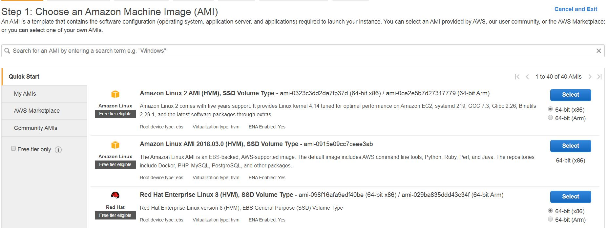
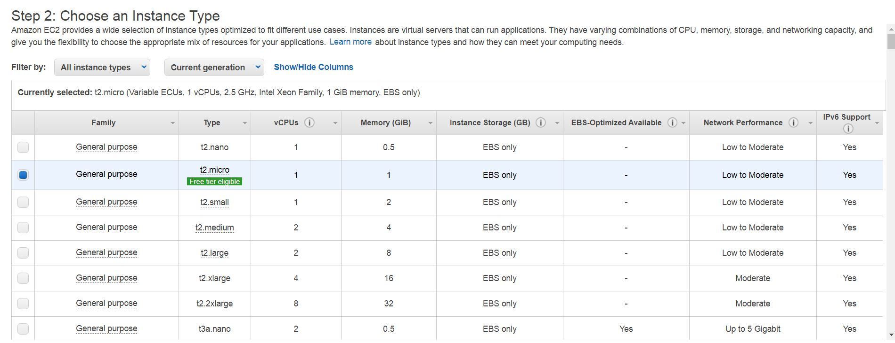
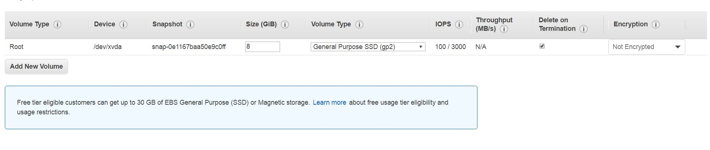
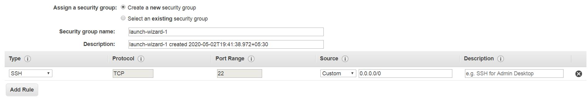
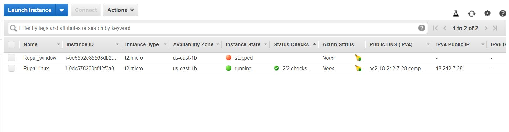
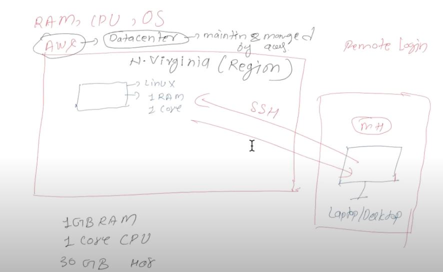

## EC2 ( Elastic Compute Cloud )

**EC2** simple means Elastic Compute Cloud .
It is one of service that is provided by the AWS.
Moreover it serve as a Infrastructure as a Service(Iaas),
because the AWS provides the server,networking facilities I.e Infrastructure.

 **For Example** 
If we want to build a house then first of all we need a basic structure of house…later on we will decide how to design our house on 
various aspects wall painting,interior design.

So the basic structure of house serve as a Infrastructure…

Similarly **EC2** can be assumed to be similar that of house structure…
 
Later on it provides facility of adding softwares,apps,database or anything else means in EC2 we have control of operating system.
(I.e we can design our house and can make the modifications as per our choice).
In **EC2** each server is known as instance,

**Now Let See....How to create a EC2 in AWS"***

---

 ```
 1.We launch a EC2 server (instance)
 ```
 *Here select the os you want such as linux,window and so on..*
 
 



---

```
2.Secondly ,we choose an instance type
```
*Here select the appropriate instance type according to your requriments(i.e combination of CPU,memory,Storage,capacity)*





---
 
 ```
 3.Now add Storage aacording to your requriments
 

```
*You can attach additional EBS volumes and instance store volumes to your instance, or edit the settings of the root volume.*




---
 
 ```
 4.Secondly we connect to EC2 server through remote protocols such as SSH ,etc..
 

```
*you can add rules to allow specific traffic to reach your instance.*





---

```
5.Now as soon we r connected to instance we got interface of the instance launched(GUI in case of windows server,
click in case Linux distribution)
```
*Here launch the instance....And you are ready to Go* 




---

But there r services such as RDS that serve as platform as a Service(Paas)
(Means we purchased a flat fully designed by builder and we r not allowed to make the modifications to the house) 



**About EC2**

*EC2 is a part of  compute services of amazon web services.

*In EC2 storage called as volume

*EC2 is like having laptop/desktop ie (vitual machine)

*We can create a remote machine i.e. EC2 as per our requirement like OS, Storage, RAM, Processor, etc

*EC2 is remote machine hence we can modify its specification as per our requirement.

*When  can start and stop the instance of EC2, then Amazon will charge only for volume


