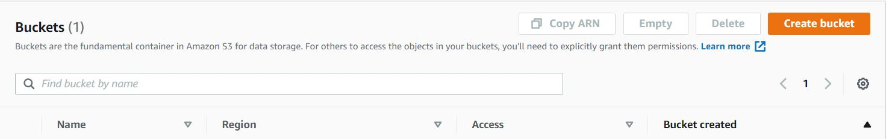
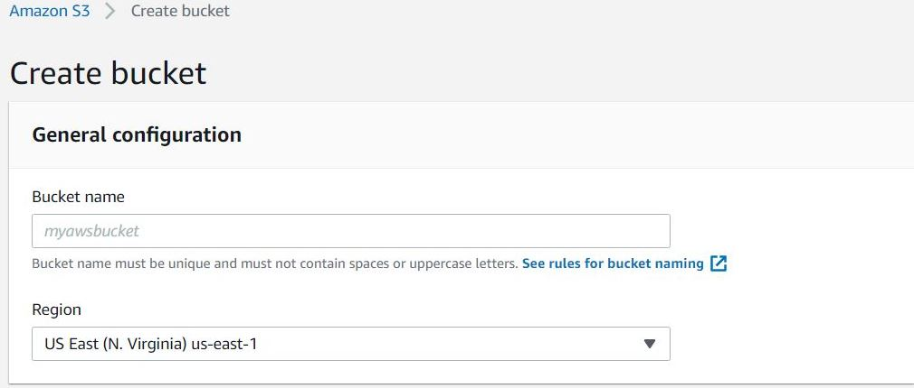
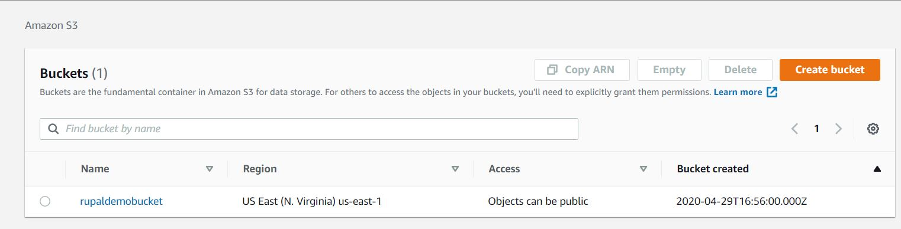
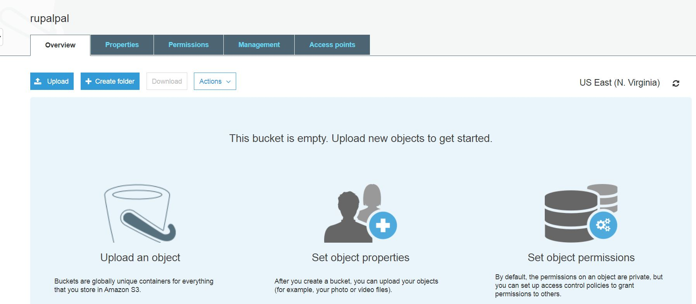
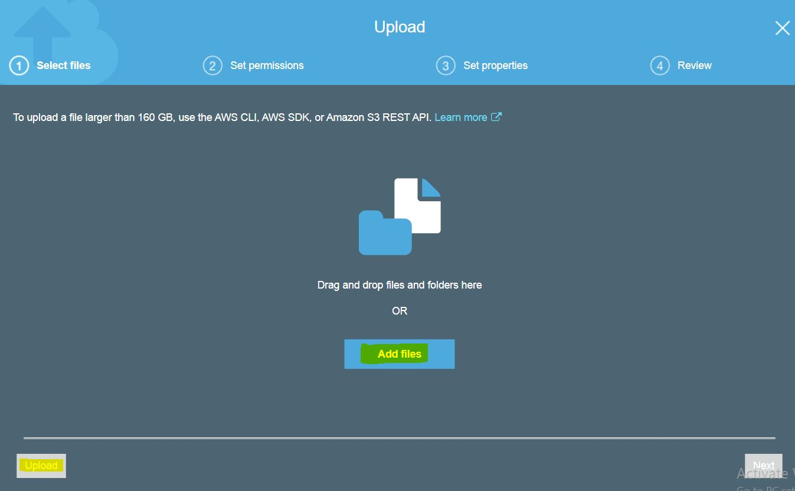
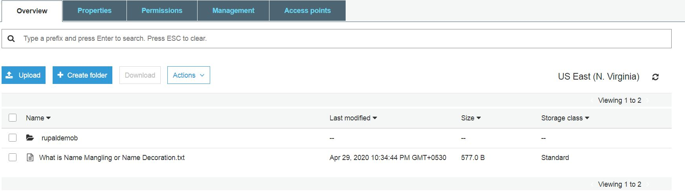
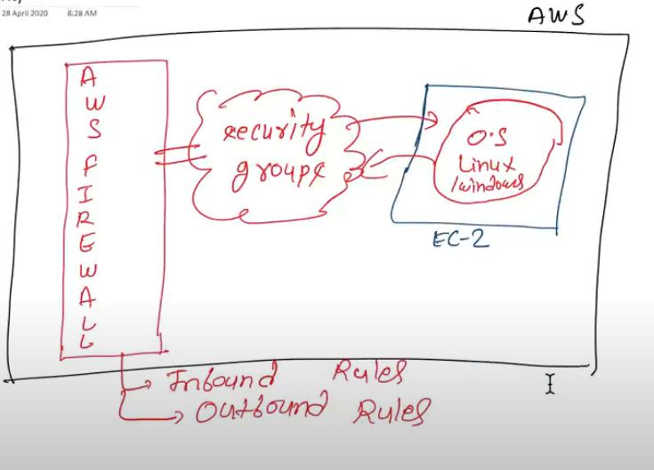

## S3(Simple Storage Device)

S3 is storage web service,which is a storage engine which is used to store and retrieve any amount of data.
We have to create Bucket inside S3 to store the data.A bucket is a container (web folder) for objects (files) stored in Amazon S3. 
Buckets form the top-level namespace for Amazon S3, and bucket names are global.
This means that your bucket names must be unique across all AWS accounts
We can also do web-hosting on s3 if the pages are static or dynamic pages are created react only.


**How to create bucket?**

---
```
1. Sign in to the AWS Console.
```
---
```
2. Open the Amazon S3 console and choose to create bucket button.
```



---
```
3. On Name and Region page
```




**note:-Enter bucket name and it must be unique across all existing buckets in Amazon S3**

---
```
4. Now, click on bucket you have made.
```




---
```
5. To upload a file/folder, click on upload button and fetch your file/folder you want to insert.
```

---



---



---




**note: while uploding a file your internet is going to be used not aws one.**

---

```
6. On Set properties page, configure properties for bucket
```
---
```
7. On Set permissions page, we can give access according to the role
(private, owner, public)
```
---
```
8. On Review Page, we can edit our settings too after verifying the settings.
```

----

## SECURITY GROUPS:
Security groups works as a virtual firewall, controls both inbound and outbound traffic.


## INBOUND RULES:
Inbound means incoming traffic coming to your EC2 instances. For that ywe have to add inbound rules.

## OUTBOUND RULES:
Outbound means outgoing traffic from your EC2 instances. To connect internet or any browser we have to add outbound rule.


## FEATURES OF AMAZON S3
* Low Cost and Easy to Use
* Secure
* Scalable
* Higher Performance

