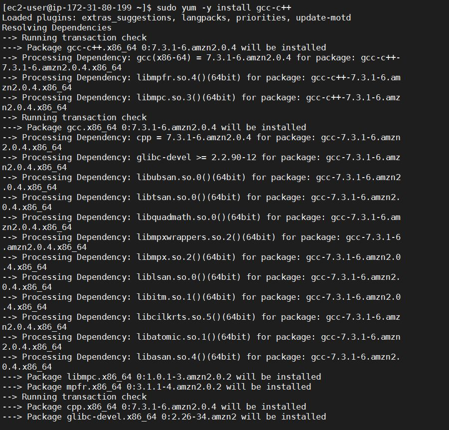
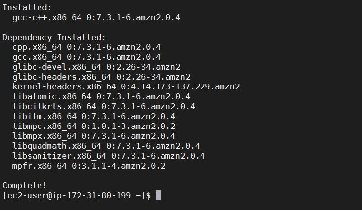
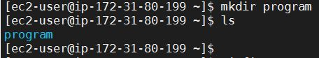
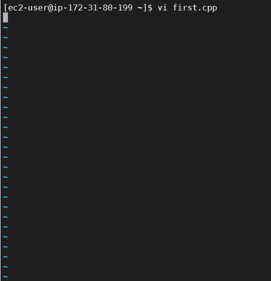
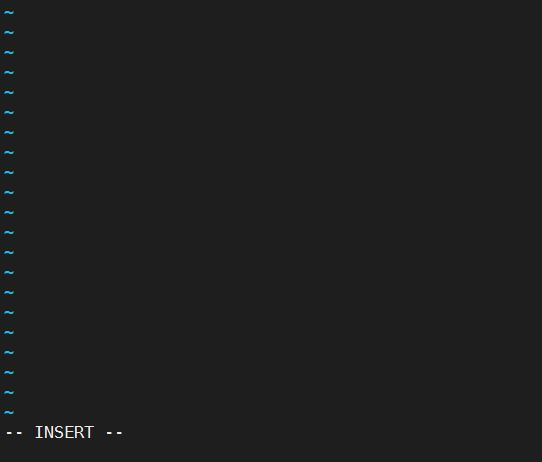
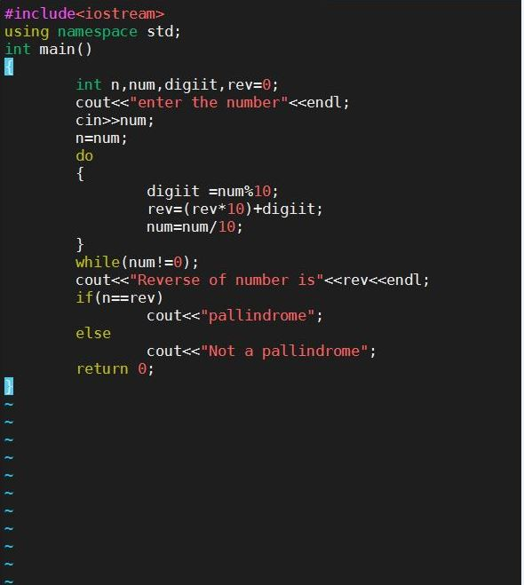
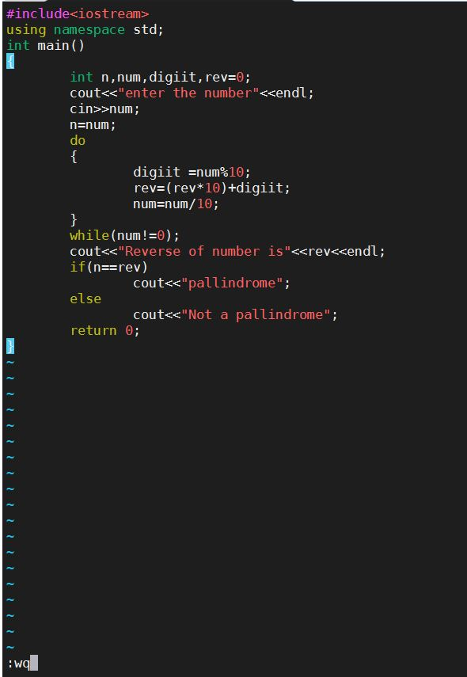
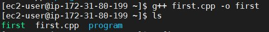
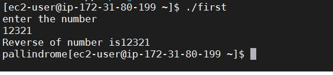

## To execute C++ program on linux 
---

**step 1**

```
Open the cmd and check whether you are having g++ tool in your linux system or not by using "gcc -v"

if not,

the message display as "command not found"....then you have to install gcc 

for that follow the steps as given below:
```
---

**step 2**

+ command: sudo yum -y  install	gcc-c++
  - The above command will install gcc on your machine.
  
  


---

**step 3**

+ Now, after  that check whether gcc tool install successfully or not ...
   - command: gcc -v
   

 
 
 ---
 
 **step 4**
 
 #<ins>CREATE A DIRECTORY</ins>
 ---
 
 + Command: "mkdir" program
  - Here, we are creating directory by using "mkdir command" along with name of your directory you want.(ie.program in our case)
  
   

+ To check whether our directory created or not enter following command
   - command: ls
   - Which will list all files and directory of current working directory 
	 
---

**step 5**

#<ins>COMPILE AND EXECUTE CPP CODES:</ins>
---
 
+ First create cpp file using vi tool by using following command
 -  Command: vi first.cpp 
 
 
   
   
   
---

**step 6**

+ perss "i" to enter into insert mode

  (here it will allow you to write code/text )
  
  
  
  

---

**step 7**

+ Now,write your CPP code
    - *FOR EXAMPLE*
	
	
  

---

**step 8**

+ After uou are done with the above code press the "ESC" key and write ":wq" command
  - command :wq (To save the file and exit the editor simultaneously)
 
 
  
  

---

**step 9**

+ Check whether .cpp file created successfully or not enter following command
 - command: ls (here you can see we have successfully created first.cpp file)
 
 
     
  
  
____

**step 10**
	
+ Compile your file using gcc tool.
 - command:  g++ first.cpp -o first
             (here first is the name of your output after compilation process)
			 
  
  
  
---

**step 11**

+ EXECUTE THE PROGRAM
 - command: ./first
 
  

---
	 
